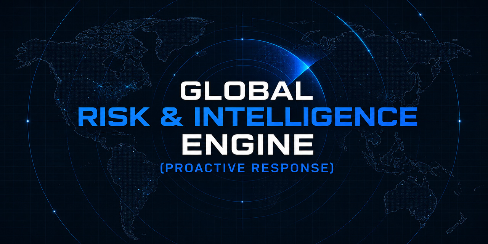
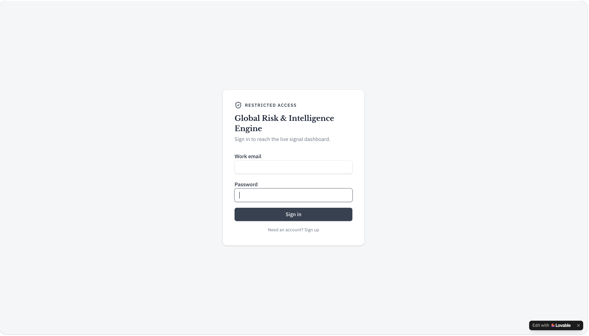
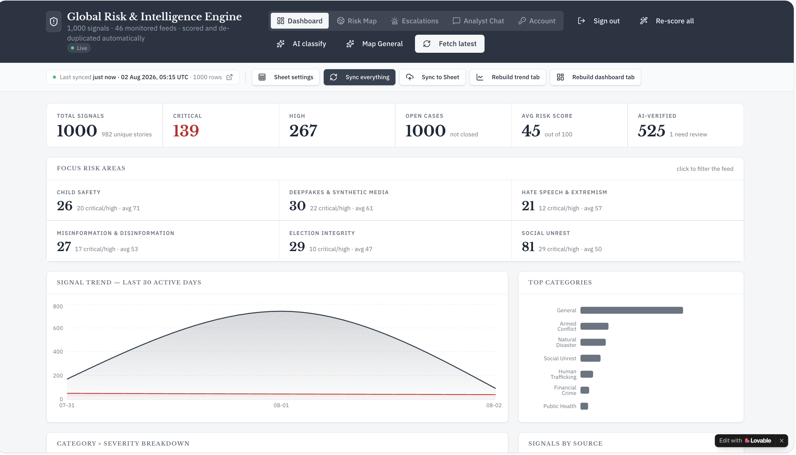
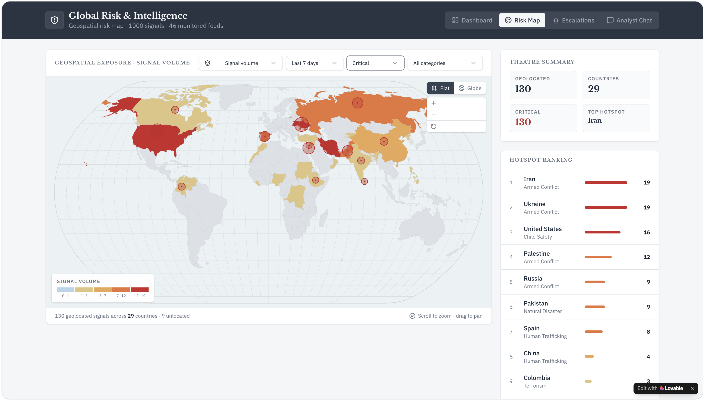
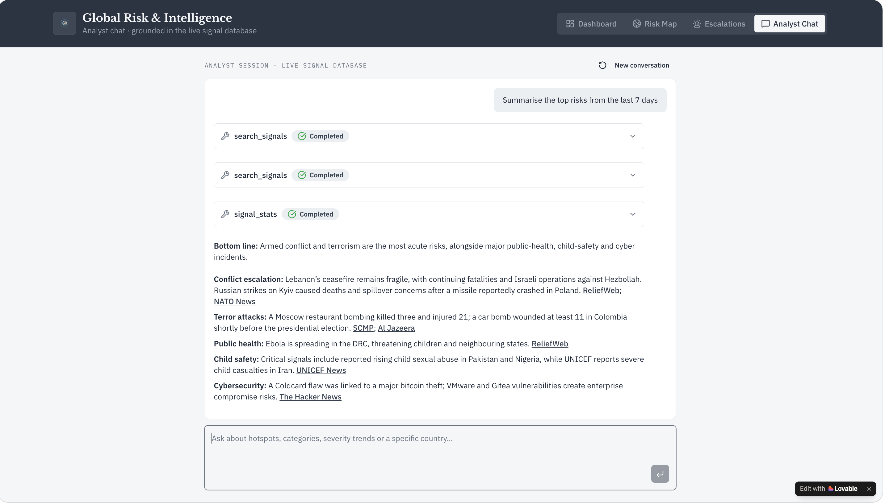
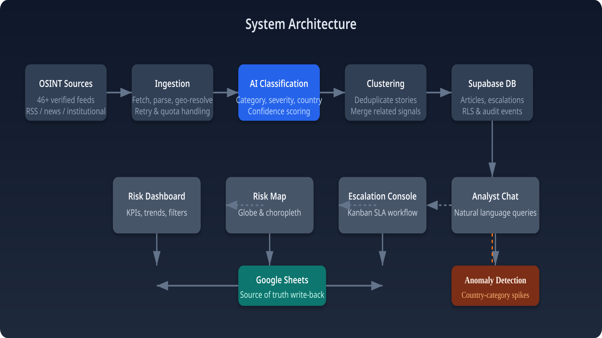
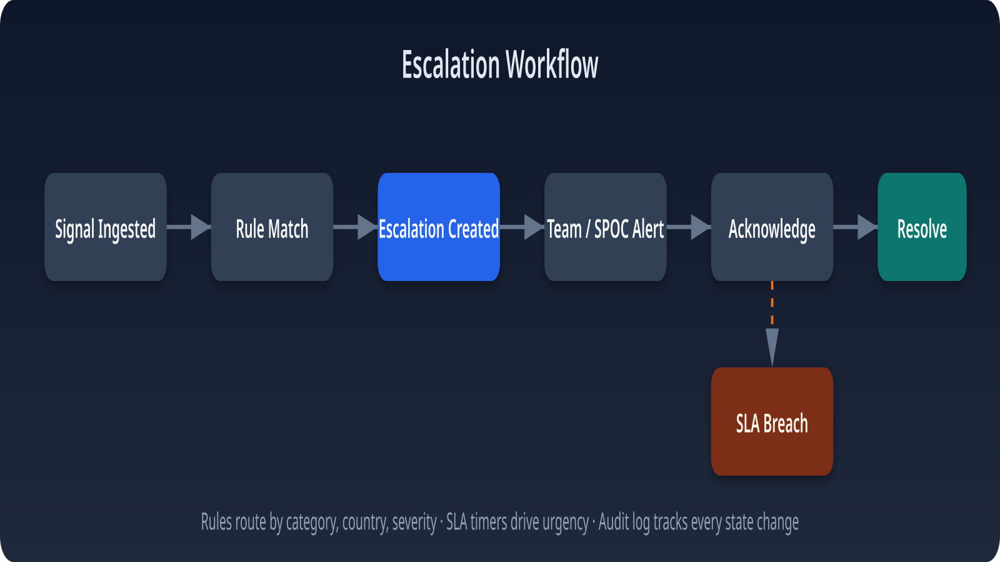

# 🌍 Global Risk & Intelligence Engine



> **A proactive Open-Source Intelligence (OSINT) platform that continuously collects global signals, classifies them with AI, detects emerging risks, and enables faster, data-driven incident response.**

---

## Overview

Global Risk & Intelligence Engine is an AI-powered Open-Source Intelligence (OSINT) platform designed to automate the intelligence lifecycle—from signal collection to analyst response.

The platform continuously monitors global news and OSINT sources, enriches every article using AI, identifies affected countries and regions, removes duplicate stories, detects emerging trends, and supports structured investigations through dashboards, maps, AI-assisted analysis, and escalation workflows.

Originally developed as a Google Sheets automation, the project evolved into a modern full-stack application capable of supporting real-time intelligence operations.

---

# 🚧 Public Showcase

This repository contains the **public showcase** of the Global Risk & Intelligence Engine.

The production implementation—including the complete source code, backend services, AI pipelines, infrastructure, deployment, operational datasets, automation workflows, and proprietary business logic—remains **private** due to confidentiality, security, and intellectual property considerations.

This repository demonstrates the platform's:

- Product vision
- System architecture
- Core capabilities
- Intelligence workflows
- User experience
- Technical approach
- Supporting documentation

---

# 🛠 Development Approach

This project was developed using an **AI-assisted software engineering workflow**, combining modern AI development tools with traditional software engineering practices.

Development included:

- **Lovable** for rapid application development and iterative UI implementation.
- **Prompt Engineering** for designing AI workflows, structured outputs, intelligence pipelines, and feature behavior.
- **OpenAI** for AI-powered classification, metadata generation, and natural language capabilities.
- **Human-led architecture**, including workflow design, product decisions, data modeling, validation, testing, and overall system engineering.

AI significantly accelerated development and prototyping, while the architecture, business logic, workflows, and engineering decisions remained human-driven.

---

# ✨ Highlights

- 🌐 46 monitored intelligence sources
- 🤖 AI-powered classification & scoring
- 🌍 Country & geospatial intelligence
- 🔄 Story de-duplication
- 📈 Trend & anomaly detection
- 🗺 Interactive global Risk Map
- 🚨 Escalation workflow
- 💬 AI Analyst Assistant
- 📑 Google Sheets synchronization
- 🔐 Secure authentication & role-based access

---

# 📸 Platform Preview

## 🔐 Secure Authentication

The platform uses authenticated access to protect intelligence data, analyst workflows, and investigations.

Only authorized users can access dashboards, maps, and AI-powered intelligence capabilities.



---

## 📊 Intelligence Dashboard

A centralized operational dashboard providing a real-time overview of monitored signals, AI-generated risk scores, category distribution, trend analysis, and operational KPIs.

### Dashboard includes

- Live intelligence monitoring
- Risk score distribution
- Critical vs High vs Medium signals
- Category breakdown
- Trend analysis
- Feed synchronization
- Operational metrics



---

## 🌍 Interactive Risk Map

A geospatial intelligence workspace for monitoring incidents across countries and regions.

Analysts can explore intelligence by severity, category, geography, and timeframe to quickly identify hotspots and emerging risks.

### Capabilities

- Interactive world map
- Country-level filtering
- Severity filtering
- Theatre summary
- Global hotspot ranking
- Geographic risk visualization



---

## 💬 AI Analyst Assistant

The platform includes an AI-powered analyst workspace that allows investigators to query intelligence using natural language.

Instead of manually navigating dashboards, analysts can ask questions such as:

> **"Summarize the top risks from the last 7 days."**

The assistant searches the intelligence database, retrieves relevant signals, and generates grounded summaries supported by the available intelligence.

Example use cases:

- Executive summaries
- Country intelligence
- Threat trends
- Category summaries
- Historical lookups
- Severity analysis



---

# 🚀 Core Features

### 📡 Live Intelligence Collection

- Continuous monitoring of global OSINT and news sources
- Background synchronization
- Retry logic & fallback feeds
- Feed health monitoring

---

### 🤖 AI Classification

Every incoming article is automatically enriched with:

- Risk category
- Severity
- Country
- Region
- Structured metadata

---

### 🔄 Story De-duplication

Clusters related stories into a single incident, reducing duplicate investigations and improving signal quality.

---

### 📈 Trend & Anomaly Detection

Automatically identifies unusual activity using statistical analysis.

Examples include:

- Country spikes
- Category spikes
- Emerging incidents
- Sudden reporting increases

---

### 🌍 Interactive Risk Map

Visualize global incidents geographically with country-level filtering and hotspot analysis.

---

### 🚨 Escalation Workflow

A Kanban-style investigation workflow supporting:

- New
- In Progress
- Escalated
- Resolved

with ownership, severity, priority, and SLA tracking.

---

### 💬 AI Analyst Assistant

Natural-language interface for querying intelligence data.

---

### 📑 Google Sheets Synchronization

Bidirectional synchronization allows analysts to continue familiar spreadsheet workflows while benefiting from automated intelligence enrichment.

---

# ⚙ High-Level Workflow

```text
Global News & OSINT Sources
            │
            ▼
      Feed Collection
            │
            ▼
      AI Classification
(Category • Country • Severity)
            │
            ▼
      Story De-duplication
            │
            ▼
 Intelligence Database
            │
     ┌──────┴─────────────┐
     ▼                    ▼
Google Sheets      Trend Analysis
            │
            ▼
Dashboard • Risk Map • Analyst Chat • Escalation
```

---

# 🏗 Architecture



The platform follows a layered architecture:

1. Intelligence Collection
2. Processing & Enrichment
3. AI Classification
4. Intelligence Storage
5. Analytics & Detection
6. Visualization & Investigation

Each layer transforms raw information into actionable intelligence while maintaining clear separation of responsibilities.

---

# 🚨 Escalation Workflow



Every incident progresses through a structured lifecycle.

```text
New
 │
 ▼
In Progress
 │
 ▼
Escalated
 │
 ▼
Resolved
```

Ownership, priority, SLA, and investigation history remain attached throughout the workflow.

---

# 📚 Documentation

| Document | Description |
|----------|-------------|
| 📄 Risk_Engine.pdf | Product walkthrough and feature overview |
| 📄 Source_of_Truth_OSINT.pdf | Architecture, workflows, and system design |

---

# 💻 Technology Stack

| Layer | Technology |
|--------|------------|
| **Frontend** | React 19 |
| **Framework** | TanStack Start |
| **Language** | TypeScript |
| **Styling** | Tailwind CSS v4 |
| **UI Components** | shadcn/ui |
| **Backend** | Supabase |
| **Database** | PostgreSQL |
| **Authentication** | Supabase Auth |
| **AI Integration** | OpenAI |
| **Maps** | d3-geo |
| **Charts** | Recharts |
| **Package Manager** | Bun |

---

# ⚡ Development Workflow

| Area | Tools & Approach |
|------|------------------|
| AI-assisted Development | Lovable |
| Prompt Engineering | OpenAI GPT |
| Frontend | React + TanStack Start |
| Backend | Supabase + PostgreSQL |
| UI Development | Tailwind CSS + shadcn/ui |
| Data Visualization | d3-geo + Recharts |
| Package Management | Bun |

---

# 📁 Repository Structure

```text
.
├── README.md
├── LICENSE
│
├── hero-banner.png
├── login.png
├── dashboard.png
├── Risk_map.png
├── Analyst_chat.png
│
├── architecture-diagram.png
├── escalation-workflow.png
│
├── Risk_Engine.pdf
├── Source_of_Truth_OSINT.pdf
│
└── src/
```

---

# 🗺 Roadmap

- ✅ Live OSINT ingestion
- ✅ AI classification
- ✅ Risk scoring
- ✅ Country extraction
- ✅ Story de-duplication
- ✅ Trend analysis
- ✅ Interactive Risk Map
- ✅ Analyst Chat
- ✅ Escalation workflow
- ✅ Google Sheets integration

Planned enhancements:

- Email notifications
- Executive PDF reports
- Multi-language intelligence
- Advanced forecasting
- Knowledge graph integration
- Threat actor profiling
- Mobile optimization
- Custom alert rules

---

# 📌 Project Status

**Public Showcase Repository**

This repository showcases the architecture, workflows, user experience, and technical approach behind the Global Risk & Intelligence Engine.

The production implementation—including backend infrastructure, automation pipelines, AI services, deployment, operational datasets, and proprietary **workflows—remains PRIVATE**.

---

# ⚠ Disclaimer

The screenshots, documentation, diagrams, workflows, and supporting materials included in this repository are intended to demonstrate the platform's capabilities and design.

Certain implementation details have been simplified or intentionally omitted to protect confidential information, proprietary workflows, and production infrastructure.

---

# 📄 License

Copyright © 2026 **Imtiaz Hussain Laskar**

**All rights reserved.**

This repository is shared publicly for demonstration, educational, research, and portfolio purposes only.

No part of this repository—including its source code, documentation, diagrams, reports, images, or other materials—may be copied, reproduced, modified, distributed, published, sublicensed, or used without prior written permission from the copyright holder.

See the **LICENSE** file for complete license terms.

---

# 🙏 Acknowledgements

Designed and developed by **Imtiaz Hussain Laskar**.

This project explores the intersection of **Open-Source Intelligence (OSINT)**, **AI-assisted software engineering**, **prompt engineering**, **risk analytics**, and **intelligence workflow automation**.

AI tools—including **Lovable** and **OpenAI**—accelerated development and prototyping, while the overall architecture, workflows, product vision, and engineering decisions were designed, validated, and refined through an iterative human-led engineering process.

---

## ⭐ Support

If you found this project interesting, consider giving the repository a **star**.

Feedback, discussions, and ideas are always welcome.
